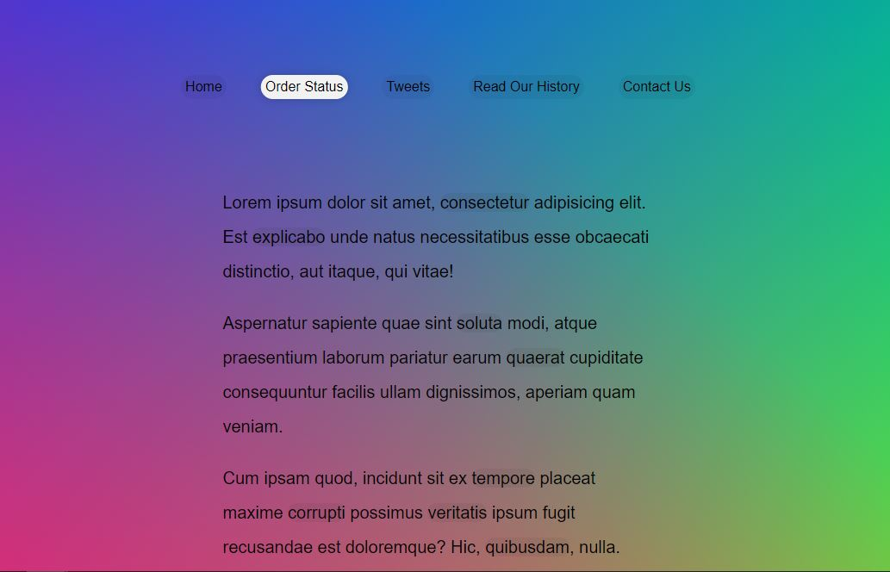

# FollowAlongLinkHighlighter

This is project 22 in Wes Bos' JavaScript 30 course.  In this lesson we built a simple webpage, and had the a href tags highlight when you mouse over them. This was an interesting project becuse the highlight function needed to change size based on which text was highlighted. 

If you're interested in doing the project yourself, you can find the video <a href="https://www.youtube.com/watch?v=POP_qri7RA8&list=PLu8EoSxDXHP6CGK4YVJhL_VWetA865GOH&index=22">here.</a>

